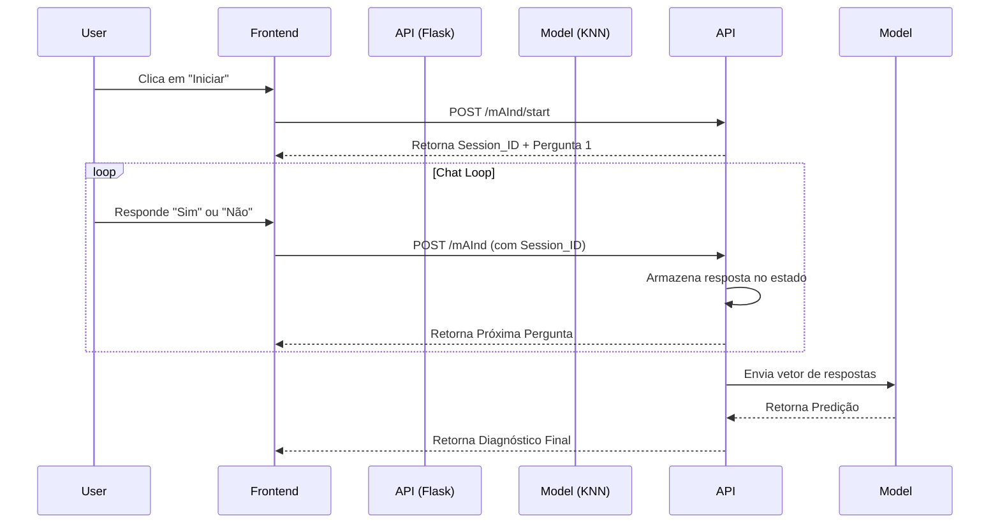

# mAInd - Backend (API de Diagnóstico Mental com IA)

API desenvolvida em **Python** com **Flask** para alimentar o chatbot "mAInd". O sistema utiliza um modelo de Machine Learning (KNN) para realizar triagem prévia de condições de saúde mental (Ansiedade, Depressão, Estresse, Solidão) baseado em respostas do usuário.

Projeto apresentado na **FETIN (Feira Tecnológica do Inatel)**.

## 🧠 Tecnologias & Arquitetura

- **Framework:** Flask (Python)
- **ML Algorithm:** K-Nearest Neighbors (KNN) via Scikit-learn
- **Serialização:** Pickle (Carregamento do modelo treinado)
- **Sessão:** Gerenciamento de estado de conversa por usuário via UUID
- **CORS:** Habilitado para integração com Frontend externo

## ⚙️ Fluxo da Aplicação



## 🚀 Como Rodar

1. Instale as dependências:
```bash
pip install flask flask-cors numpy scikit-learn
```
2. Execute o servidor:
```bash
python app.py
```
O servidor rodará em http://127.0.0.1:5000.

## 📡 Endpoints

### `POST /mAInd/start`
Inicia uma nova sessão de conversa. Gera um UUID único para o usuário.

### `POST /mAInd`
Recebe a resposta do usuário e retorna a próxima interação ou o diagnóstico final.
- **Body:** `{ "user_id": "...", "text_mensage": "sim" }`

## ⚖️ Sobre o Modelo
O sistema utiliza um classificador **KNeighborsClassifier**. O modelo recebe um vetor binário de respostas e classifica o usuário em uma das 5 categorias: Normal, Stress, Loneliness, Depression ou Anxiety.
